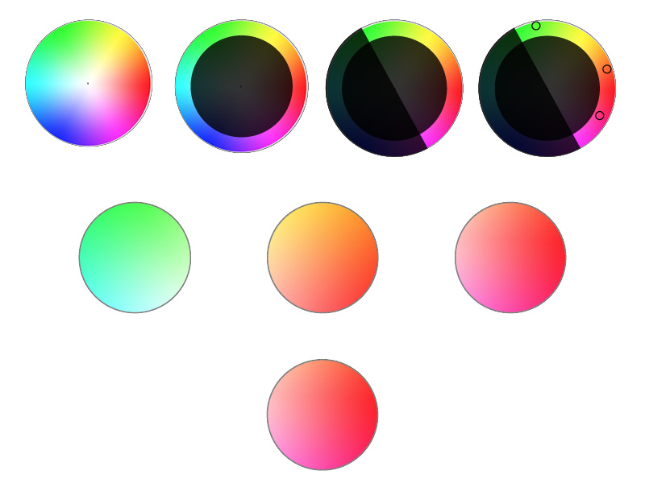
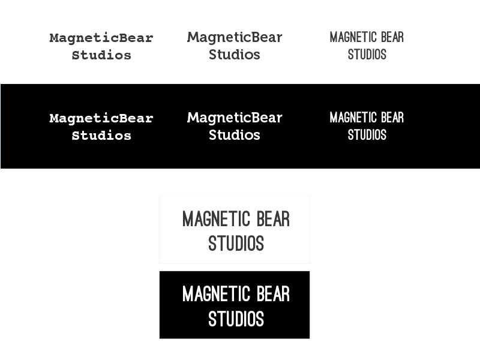
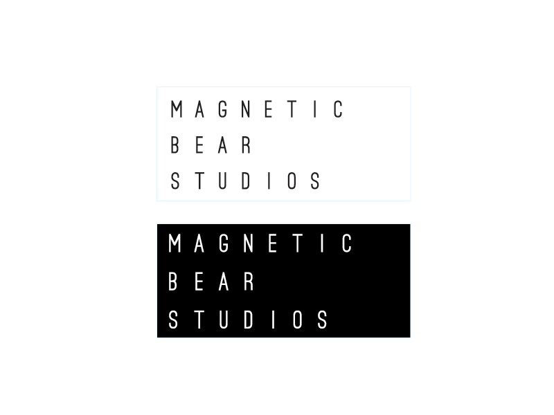
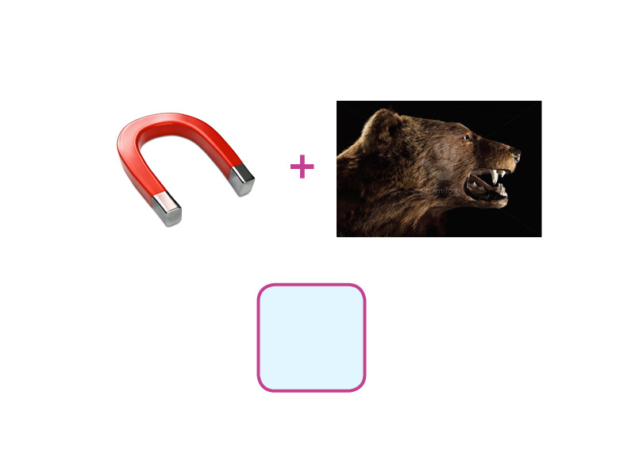
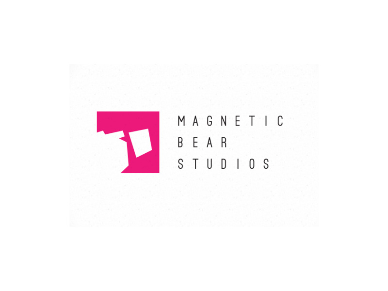
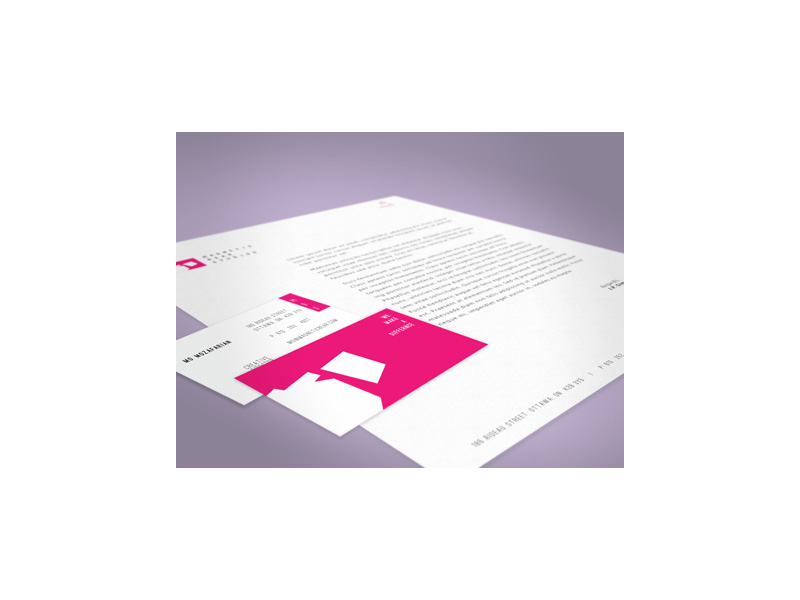
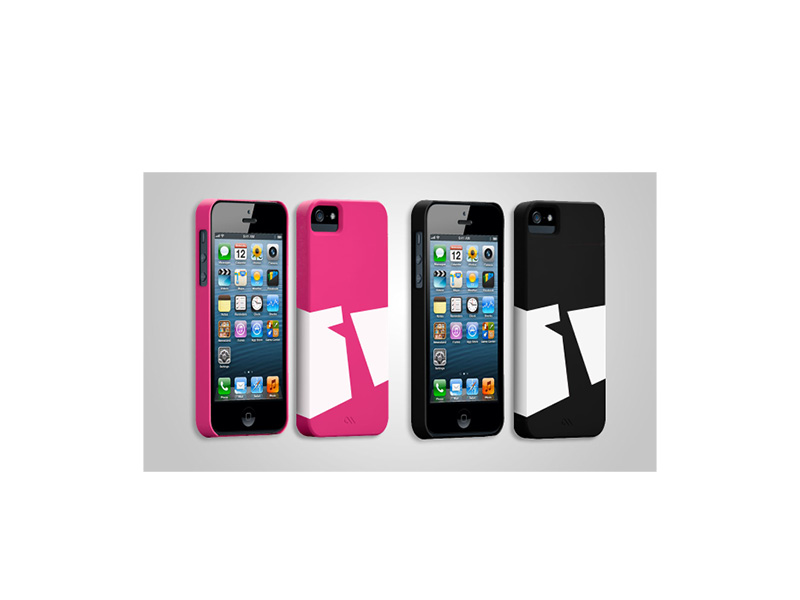
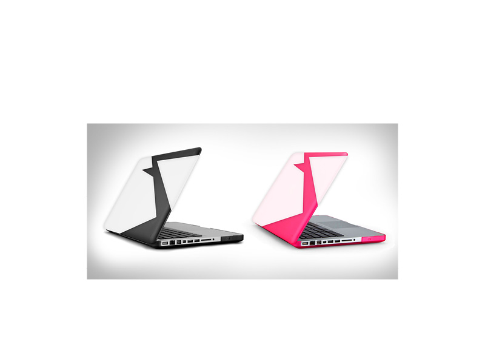
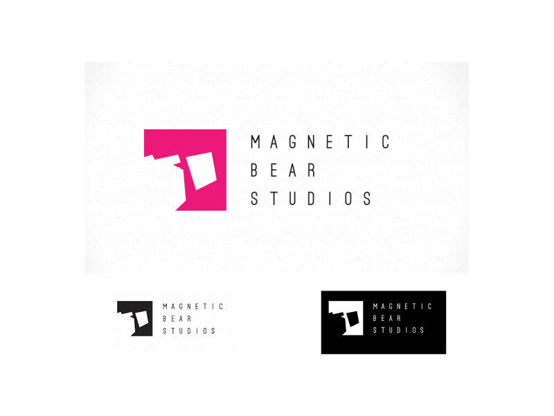

As part of our new year's resolution to open source more of our work, I thought it would be a good idea to write up a brief case study on our rebranding process and the creative approach to establishing our new identity.

---

We started the process by digging into our core values and our value proposition. In addition, we re-affirmed our competition, our customers and our consumers. The main goal of this phase was to verify and evaluate our current branding and marketing strategies. We spent almost three full weeks on this phase and gained a lot of valuable insight into our vision, our team, and our position in the industry.  This discovery phase allowed us to sum up MBS in a few words: Young, energetic, enthusiastic, smart, cutting edge, tech savvy, casual, laid back, team-oriented, and focused.

After all the research and industry analysis was completed, we all agreed that MBS’ old branding and brand strategies didn’t accurately represent the company, its quality work, and its core values. Part of our new branding direction and strategy was the new brand identity package. 

Here's a breakdown of the process: 

Color choice:
-------------
Choosing the perfect color that would best represent MBS wasn't that easy. Some people may think the color choice is a personal preference but we took a purely scientific approach. In order to figure out the right corporate colors we started eliminating the ones that wouldn't work.
Our ideal color was something very saturated, warm, welcoming and cutting edge.

Font choice:
------------
From the very beginning, we knew that the serif fonts were off the table. Serifs are old, very formal and don't really look that great on digital screens. However, slab serifs didn't seem too bad. We were looking for something modern, geometric and possibly tall. 

Our final choice was going with the sans-serif family. Even though our initial font choice was very close to what we were looking for, we wanted something more unique. We decided to create our own custom typeface.

Symbol:
-------
We wanted to choose the right symbol. One that was not too cheesy or too formal. This was probably the toughest part of the whole process. We went through a lot of different possibilities but kept our focus on creating something memorable, clever, minimalistic, and unique. if we could get a "aha, I get it!" moment out of it, that'd be swell.

That was a brief case study on Magnetic Bear Studios' rebranding. I hope you enjoyed it.